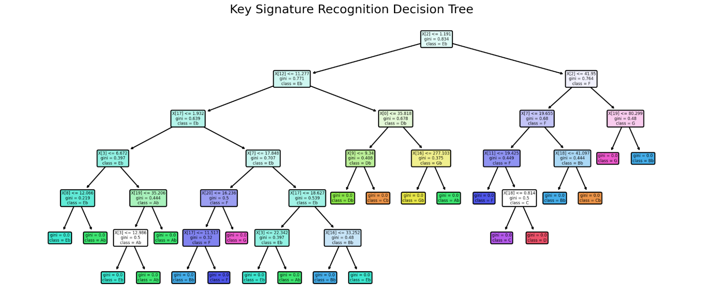

A Brief Overview of Music Theory Basics

To begin with, there are seven names describing each note in Western musical harmony, the letters A - G. Each rising white key on a keyboard represents an increase in note value by one. Once the last letter, G, is reached, the cycle begins again, so the next letter after G would be A again. This pattern repeats up the entire length of the keyboard.

However, one can see that there are more than just white keys on a keyboard. So, how do we notate in music that we want to access the black keys? By applying something called “accidentals” to our seven given notes. Adding a sharp(#) or a flat(♭) after a note indicates that that note should be played a half-step higher or lower, respectively. A half-step is defined as the smallest possible interval between two notes; so, a G# would be the black key directly to the right of the G key, and a D♭ would be the black key directly to the left of the D key. Note that, in the cases of B# and E#, and C♭ and F♭, there is no black key to go to; in these cases, we just go to the next white key, so a B# is the same key as C.

This introduces us to an important concept in music theory - the idea of “enharmonic equivalence”. Essentially, there are notes that, while notated differently, would be played using the same key on a keyboard. For example, F# and G♭ would both be played on the black key between those two notes. Thus, a fully notated keyboard would appear as such:

The next concept to discuss is that of scales. As far as the scope of this project, we will only be concerning ourselves with the major scale. A scale is a set of musical notes, set in ascending order. These scales can be described by how each note relates to its successor, usually described in terms of half-steps(notated asH) and whole-steps (a whole step being two half-steps)(notated as W). In the case of a major scale, which consists of 8 notes, this relationship would be described as W-W-H-W-W-W-H.

        The easiest way to show this would be to use the C major scale. Looking at our keyboard diagram above, we can find one of the C notes (this will be referred to our root). Looking at our major scale “algorithm”, our next note is a whole step above C, so it must be D. The next note after that is another whole step, which would be E. Then, we get to our first half step, which makes our fourth note F. This process continues for G, then A, then B, and then we’re back to C. Note that, in the case of C major, this consists only of white notes on a keyboard. However, this process can be started from any key. So, a G major scale is comprised of the letters G, A, B, C, D, E, F#, and G, while an A♭ major scale would consist of A♭, B♭, C, D♭, E♭, F, G, and A♭.

        For our next topic, we will be discussing the basics of musical notation. Musical notes are placed either on, between, above, or below a series of five lines (called a staff), with its placement determining its pitch.

This example shows the basics of what musical notation might look like, as well as how each note coordinates to its placement on a keyboard. Note that, while not included in this example, the concept of sharps and flats can still be applied; however, in regards to a staff, the accidental would be placed before the note, rather than after (this is done to facilitate ease of reading for musicians, so they know to modify the note’s pitch ahead of time).

        The last major (no pun intended) idea is that of key signatures. Say, for example, a composer wanted to write a piece in A♭ major. Instead of needing to write out every accidental as it comes in the music, a key signature is put at the beginning of a piece of music; this tells us what the base scale (and by extension, accidentals) are being used, and the accidentals from this scale should be applied to every note throughout.

        In this example, there are two flats placed in the key signature, B♭ and E♭. This means that, throughout the piece, every B and E encountered should, by default, be played as B♭ and E♭. Additionally, the scale that would be associated with these accidentals would be Bb major. Thus, by looking at the key signature, it can be said that this piece would be in Bb major.

        Now, let’s look at one last example, this time using a real-world piece. This excerpt is from Bach’s Partita No. 3 for the violin. By using the notes in the piece, and the key signature to modify the notes, we can see that the notes used in this excerpt are E, F#, G#, A, B, C#, D#, and E. As a result, we can determine that the key for this piece is E major.

        This brings us to the objective of our project: by scanning through music, can we determine the key of the piece? We feed music into a variety of machine learning models, and use them in order to predict key signatures of future pieces.

The Machine Learning Algorithms Used:

Naive Bayes

        Using the naive bayes machine learning algorithm we achieved a training accuracy of 84%  and a testing accuracy of  67%.

Decision Tree

Our decision tree for key signature recognition yielded a 100% training accuracy and a 52.3% test accuracy on an input of 59 training samples and 21 testing samples, using gini as the criterion and a splitting randomly. These parameters significantly improved the accuracy from 42% when using entropy as criterion and best for splitting. I think going forward the accuracy can be improved by adding more training and testing data, but some of our original data had too many key changes and accidentals for our model to handle, so we had to remove those samples. 

Neural Network
